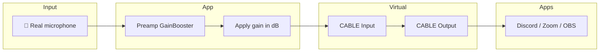
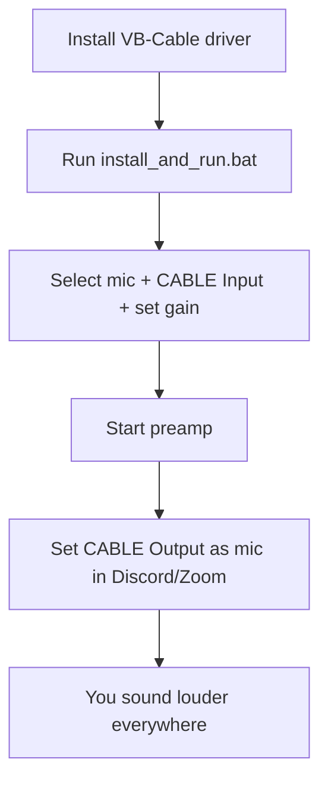

<p align="center">
  
  
</p>

<h1 align="center">🎚️ Preamp GainBooster</h1>
<p align="center">
  <strong>Virtual microphone preamp for Windows</strong><br/>
  Boost your mic gain digitally • Use in Discord, Zoom, OBS & any app
</p>

<p align="center">
  <a href="#-what-is-this">What is this?</a> •
  <a href="#-features">Features</a> •
  <a href="#-how-it-works">How it works</a> •
  <a href="#-quick-start">Quick Start</a> •
  <a href="#-usage">Usage</a> •
  <a href="#-troubleshooting">Troubleshooting</a>
</p>

---

## 🎯 What is this?

**Preamp GainBooster** is a small Windows app that acts as a **digital preamp** for your microphone.  
Your mic is too quiet in Discord, Zoom, or streaming? This app **raises the volume (gain)** before the sound reaches those apps—so you sound louder and clearer everywhere, **without buying hardware**.

```
🎤 Your mic  →  [ Preamp GainBooster ]  →  🔌 Virtual cable  →  Discord / Zoom / OBS
                    ↑ you set the dB
```

## ✨ Features

| Feature | Description |
|--------|-------------|
| 🎚️ **Gain control** | Adjust mic level from **-6 dB to +30 dB** with slider or number box |
| 🔌 **Virtual cable** | Sends boosted audio to **VB-Cable**; any app can use it as “CABLE Output” mic |
| 🎧 **Monitor** | Optional: hear yourself in your headphones (sidetone) |
| 💾 **Presets** | Save and load gain presets by name (e.g. “Streaming”, “Quiet room”) |
| 🌍 **8 languages** | Español, English, Français, Deutsch, Português, Italiano, Русский, 中文 |
| 🖥️ **System tray** | Minimize to tray; choose on close: **Quit** or **Minimize to tray** (and remember) |
| 🚀 **Run at startup** | One click to run when Windows starts |
| 🎨 **Dark UI** | Purple cyberpunk-style theme, easy on the eyes |
| 📦 **Minimal setup** | Only **2 files**: one `.bat`, one `.py` — no `requirements.txt` |

---

## 🔄 How it works




### 📊 User journey (high level)



---

## 📋 Requirements

| Requirement | Notes |
|-------------|--------|
| 🪟 **Windows** | Tested on Windows 10/11 |
| 🐍 **Python 3.8+** | Installed automatically by the `.bat` via winget if missing |
| 🔌 **VB-Cable driver** | You must install it once from [vb-audio.com/Cable](https://vb-audio.com/Cable/) |

---

## 🚀 Quick Start

### 1️⃣ Install the virtual cable driver (one-time)

You need **VB-Cable** so that “CABLE Input” and “CABLE Output” exist in Windows.

- Download: **[VB-Cable from vb-audio.com](https://vb-audio.com/Cable/)**
- Run **VBCABLE_Setup_x64.exe** (or x86) **as Administrator**.
- Reboot if the installer asks.

### 2️⃣ Run the app

- **Double-click** `install_and_run.bat`.  
- It will install Python (via winget) if needed, install dependencies, and start the app—**no `requirements.txt`**, everything is in the batch file.

That’s it. 🎉

---

## 📖 Usage


### Windows sound (microphone tab)

- Use the in-app button: **“Open Windows sound → Microphone → CABLE Output default”**.
- In **Sound settings**, open the **Microphone** (Recording) tab—**not** the Speaker tab—and set **CABLE Output** as the default device so all apps use it.


**Dependencies** (installed by the `.bat`): `sounddevice`, `numpy`, `pystray`, `Pillow`.

---

## 🛠️ Troubleshooting

| Problem | What to do |
|--------|------------|
| **CABLE doesn’t appear** | Install [VB-Cable](https://vb-audio.com/Cable/) and run the installer as Administrator. Reboot if asked. |
| **No sound in Discord/Zoom** | In the app, output must be **CABLE Input**. In Discord/Zoom, **input** must be **CABLE Output**. In Windows, set **CABLE Output** as default **Recording** device (Microphone tab). |
| **Monitor sounds bad / robotic** | Monitor runs at 48 kHz for compatibility. Make sure the monitor device is your **HEADPHONES**, not CABLE Input. |
| **Python not found** | Run `install_and_run.bat`; it will try to install Python via **winget**. Or install [Python](https://www.python.org/downloads/) manually and tick “Add Python to PATH”. |

---

## 🖼️ Screenshot


| What you’ll see |
|-----------------|
| Dark purple “cyberpunk” theme |
| Device lists: Input (mic), Output (CABLE Input), Monitor (headphones) |
| Gain slider + dB value + presets (Save/Load/Delete) |
| Start/Stop preamp, language selector, tray & startup options |

---
## 👤 Author

**AlexRabbit**  
🔗 [GitHub](https://github.com/AlexRabbit)

---

<p align="center">
  <sub>If this helped you, consider starring the repo ⭐</sub>
</p>
